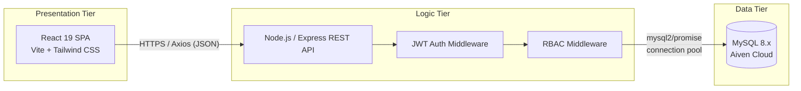
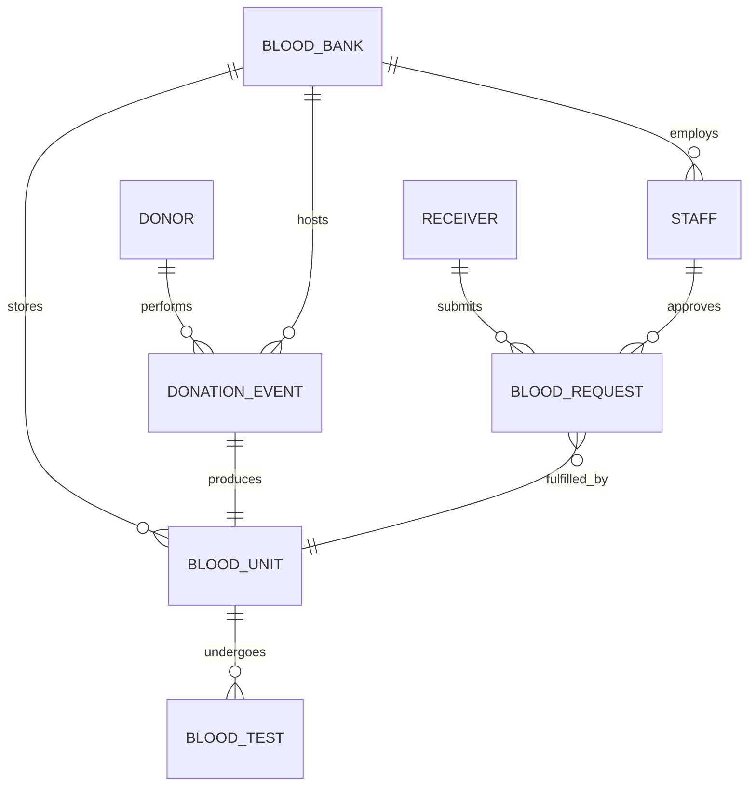

<div align="center">
  
  <h1>LifeFlow — Blood Bank Management System</h1>
  <p>A comprehensive, full-stack digital solution for modern blood bank operations, built with React, Node.js, and MySQL.</p>
  
  <p>
    
    
    
    
    
    
  </p>

  <p>
    <a href="#-overview"><strong>Overview</strong></a> ·
    <a href="#-key-features"><strong>Features</strong></a> ·
    <a href="#️-architecture"><strong>Architecture</strong></a> ·
    <a href="#️-database-design-er-schema"><strong>Database Design</strong></a> ·
    <a href="#-api-reference"><strong>API Reference</strong></a> ·
    <a href="#️-tech-stack"><strong>Tech Stack</strong></a> ·
    <a href="#-project-structure"><strong>Project Structure</strong></a> ·
    <a href="#-getting-started"><strong>Getting Started</strong></a>
  </p>
</div>

<br/>

## 🩸 Overview

**LifeFlow** is a next-generation Blood Bank Management System developed as a capstone Database Management System (DBMS) project. 

It tackles the critical challenge of manual, siloed blood inventory tracking by providing a unified platform where Donors, Patients, Hospitals, and Blood Banks can seamlessly coordinate. The system ensures that life-saving blood supplies are accurately tracked, safely stored, and rapidly deployed when emergencies strike — replacing spreadsheets and paper registers with a single source of truth.

### Why LifeFlow?

Traditional blood bank record-keeping suffers from recurring problems that LifeFlow is designed to solve directly:

| The Problem | LifeFlow's Solution |
| :--- | :--- |
| **Blood units expire unnoticed** in storage | Automated expiry tracking with proactive alerts on the dashboard |
| **No visibility** into which blood group is running low | Real-time inventory breakdown by blood group and Rh factor |
| **Manual cross-checking** of donor eligibility | Built-in eligibility rules (last donation date, test results, deferral status) |
| **Urgent hospital requests get lost** in email/phone chains | Structured workflow with urgency levels and status tracking |
| **Inconsistent or duplicated records** across departments | Normalized (3NF) relational schema enforced at the database layer |
| **Unauthorized access** to sensitive medical/donor data | JWT-based auth with granular role-based access control |

---

## ✨ Key Features & Functionalities

LifeFlow goes beyond a standard CRUD application by implementing sophisticated, real-world operational logic tailored for medical environments.

### 📱 Responsive & Adaptive UI
- **Cross-Platform Experience**: Intelligently scales from a powerful desktop web application to a touch-friendly mobile interface.
- **Card-List Views**: Complex data tables morph into readable card stacks on mobile devices for ease of access on the go.
- **Dynamic Navigation**: Responsive side-drawers and collapsible headers for uninterrupted workflows.
- **Dark/Light Theming**: Accessible color contrast tuned for long shifts in low-light lab and ward environments.

### 🔐 Enterprise-Grade Security
- **Stateless JWT Authentication**: Secure, scalable token-based login with refresh-token rotation.
- **Password Hashing**: Utilizes `bcrypt` with per-user salting; no plaintext credentials ever touch the database.
- **Role-Based Access Control (RBAC)**: Distinct permission sets mapped to real-world roles:
  - 🛡️ **Admin**: Full system control, user management, and database administration.
  - 🩺 **Doctor**: Manages patients and approves urgent blood requests.
  - 👩‍⚕️ **Nurse**: Oversees donor registrations and donation drives.
  - 🔬 **Technician**: Records blood tests and manages cold-storage inventory.
- **Audit Logging**: Every create/update/delete on sensitive tables (`blood_unit`, `blood_request`) is timestamped and attributed to the acting staff member.

### 📊 Real-Time Operations Dashboard
- **Live Inventory Tracking**: Instant visual breakdown of available blood units by blood group (A+, A-, B+, B-, AB+, AB-, O+, O-).
- **Urgent Request Monitoring**: Critical alerts for high-priority transfusion needs, sorted by urgency and time-to-expiry.
- **Expiry Forecasting**: Units approaching their shelf-life limit (typically 35–42 days for whole blood) are flagged for prioritized use or discard.

### 🩹 Donor & Donation Lifecycle Management
- **Eligibility Screening**: Enforces minimum inter-donation intervals, age, and weight thresholds before a donation event can be logged.
- **Digital Donor History**: Full donation timeline per donor, including test outcomes and any deferral reasons.

### 🧪 Testing & Quality Assurance
- **Blood Test Records**: Each `blood_unit` is linked to its `blood_test` results (HIV, Hepatitis B/C, Syphilis, Malaria) before being marked "available."
- **Quarantine Workflow**: Units failing any screening test are automatically flagged and excluded from the available inventory pool.

### 🏥 Requests & Fulfillment
- **Structured Requisitions**: Hospitals/receivers submit requests with specific blood groups, quantity, and urgency (*Routine / Urgent / Emergency*).
- **Doctor Approval Chain**: Requests route to an authorized doctor for sign-off before dispatch.
- **Compatibility Matching**: Cross-checks requested blood group against compatible donor groups (e.g., O- as universal donor) when exact matches are unavailable.

---

## 🏗️ System Architecture

LifeFlow is built on a scalable **3-Tier Client-Server Architecture**:



1. **Presentation Tier (React SPA)**: A high-performance frontend built with React 19 and Vite. Utilizes Tailwind CSS for a fluid, component-driven design system, with React Router handling client-side navigation.
2. **Logic Tier (Node.js/Express REST API)**: The core engine handling business rules, RBAC middleware, JWT validation, input sanitization, and secure parameterized query formatting.
3. **Data Tier (MySQL Cloud)**: A fully normalized relational database hosted on Aiven Cloud, accessed via efficient connection pooling to handle concurrent staff and hospital requests.

---

## 🗃️ Database Design (ER Schema)

The database is rigorously **normalized to the 3rd Normal Form (3NF)** to prevent update, insertion, and deletion anomalies. It features interconnected entities that perfectly mirror a real blood bank's operations.

### Core Entities & Relationships

| Entity | Description | Key Relationships |
| :--- | :--- | :--- |
| **`blood_bank`** | Central hubs for operations & physical storage locations | 1:N with `staff`, `blood_unit` |
| **`donor`** | Registered individuals who supply blood | 1:N with `donation_event` |
| **`donation_event`** | The physical act of donating, linked to a donor and bank | N:1 with `donor`, `blood_bank`; 1:1 with `blood_unit` |
| **`blood_unit`** | Physical blood bags (inventory), tracked from collection to expiry | 1:1 with `donation_event`; 1:N with `blood_test` |
| **`blood_test`** | Laboratory screening results for individual units | N:1 with `blood_unit` |
| **`receiver`** | Patients or hospitals requesting blood | 1:N with `blood_request` |
| **`blood_request`** | Transfusion orders with specific urgency levels | N:1 with `receiver`; N:1 with `blood_unit` (on fulfillment) |
| **`staff`** | System users (Admins, Doctors, Nurses, Technicians) | N:1 with `blood_bank` |

### Simplified ER Diagram



### Key Design Decisions
- **Cascading Deletes**: Constraints like `ON DELETE CASCADE` ensure that deleting a donor automatically cleans up their associated donation events, maintaining perfect referential integrity.
- **Status Enums**: Fields like `blood_unit.status` (*available, reserved, quarantined, expired, dispatched*) and `blood_request.urgency` (*routine, urgent, emergency*) use constrained ENUMs to keep reporting queries reliable and error-free.
- **Composite Indexing**: Frequently queried parameters, such as `blood_unit(blood_group, status, expiry_date)`, are indexed to ensure real-time dashboard calculations remain fast even as inventory scales.
- **Soft Deletes**: Sensitive records use a `deleted_at` timestamp rather than hard deletion, preserving historical/audit data for medical compliance.

---

## 🔌 API Reference & Routes

The backend provides a comprehensive RESTful API. 
*Note: All endpoints (except `/api/auth/login` and `/api/auth/register`) require an `Authorization: Bearer <token>` header.*

### Authentication & Users
| Method | Endpoint | Description | Permitted Roles |
| :--- | :--- | :--- | :--- |
| `POST` | `/api/auth/login` | Authenticate and receive a JWT token | *Public* |
| `POST` | `/api/auth/register` | Create a new staff account | Admin |
| `GET` | `/api/auth/me` | Get details of the currently logged-in user | All staff |

### Donors & Donations
| Method | Endpoint | Description | Permitted Roles |
| :--- | :--- | :--- | :--- |
| `GET` | `/api/donors` | List and search registered donors | All staff |
| `POST` | `/api/donors` | Register a new blood donor | Nurse, Admin |
| `POST` | `/api/donations` | Log a new physical donation event | Nurse, Admin |
| `GET` | `/api/donations/:donor_id` | View donation history for a specific donor | All staff |

### Inventory & Testing
| Method | Endpoint | Description | Permitted Roles |
| :--- | :--- | :--- | :--- |
| `GET` | `/api/inventory` | Live inventory summary by blood group & status | All staff |
| `POST` | `/api/blood-tests` | Submit lab test results (HIV, Hep B/C, etc.) for a unit | Technician, Admin |
| `PATCH` | `/api/inventory/:unit_id/status`| Update the status of a specific blood unit | Technician, Admin |

### Requests & Fulfillment
| Method | Endpoint | Description | Permitted Roles |
| :--- | :--- | :--- | :--- |
| `GET` | `/api/requests` | List blood requests (filterable by status/urgency) | All staff |
| `POST` | `/api/requests` | Create a new request for blood units | Doctor, Admin |
| `PATCH` | `/api/requests/:id/approve` | Approve a pending blood request | Doctor, Admin |
| `PATCH` | `/api/requests/:id/dispatch`| Mark an approved request as fulfilled/dispatched | Technician, Admin |

### Admin Tools
| Method | Endpoint | Description | Permitted Roles |
| :--- | :--- | :--- | :--- |
| `POST` | `/api/admin/sql` | Execute a raw, read-only SQL query directly against DB | Admin only |

---

## 🛠️ Tech Stack

### Frontend (Presentation)
| Technology | Purpose |
| :--- | :--- |
| **React 19** | Component-based UI architecture |
| **Vite 8** | Next-generation frontend tooling for lightning-fast HMR and builds |
| **Tailwind CSS 4** | Utility-first, highly responsive styling framework |
| **React Router 7** | Client-side routing for SPA navigation |
| **Axios** | Promise-based HTTP client for API communication |
| **Lucide React** | Crisp, scalable SVG iconography |

### Backend & Database (Logic & Data)
| Technology | Purpose |
| :--- | :--- |
| **Node.js & Express.js** | Fast, asynchronous server framework for the REST API |
| **MySQL 8.x** | Robust relational database hosted securely on **Aiven Cloud** |
| **mysql2/promise** | High-performance MySQL driver enabling async/await connection pooling |
| **JSON Web Tokens (JWT)** | Secure, stateless authentication mechanism |
| **bcrypt** | Cryptographic password hashing algorithm |
| **dotenv** | Environment-based configuration management |

---

## 📁 Project Structure

```text
LifeFlow/
├── backend/                  # Logic Tier (Node.js/Express)
│   ├── config/
│   │   └── db.js             # MySQL connection pool & Aiven Cloud setup
│   ├── controllers/          # Route handler logic (Business rules)
│   ├── middleware/
│   │   ├── auth.js           # JWT verification & parsing
│   │   └── rbac.js           # Role-based access control rules
│   ├── routes/               # Express route definitions mapping to controllers
│   ├── models/               # Query/data-access layer mapping to MySQL
│   ├── .env.example          # Environment variable template
│   ├── server.js             # Application entry point
│   └── package.json
├── frontend/                 # Presentation Tier (React/Vite)
│   ├── src/
│   │   ├── components/       # Reusable UI components (Buttons, Tables, Modals)
│   │   ├── pages/            # Route-level views (Dashboard, Inventory, Login)
│   │   ├── context/          # Global state management (AuthContext, ToastContext)
│   │   ├── services/         # Axios API clients
│   │   ├── App.jsx           # Main React component
│   │   └── main.jsx          # React DOM entry point
│   ├── index.html            # Vite HTML shell
│   ├── vite.config.js        # Vite & Tailwind configuration
│   └── package.json
├── database/                 # Data Tier Definitions
│   ├── schema.sql            # Full DDL (Data Definition Language) for 8 entities
│   └── seed.sql              # Sample/demo data for initial testing
└── README.md                 # Project documentation
```

---

## 🚀 Getting Started

Follow these instructions to run the full stack locally for development or testing.

### Prerequisites
- **Node.js** (v18 or higher)
- **npm** or **yarn**
- **MySQL Server** (If running locally instead of Aiven Cloud)

### 1. Clone the repository
```bash
git clone https://github.com/yourusername/LifeFlow.git
cd LifeFlow
```

### 2. Backend Setup
```bash
cd backend
npm install
```
Create a `.env` file in the `/backend` directory and add your MySQL credentials and JWT secret:
```env
DB_HOST=your-database-host
DB_USER=your-database-user
DB_PASSWORD=your-database-password
DB_NAME=bloodbank_db
DB_PORT=your-database-port
JWT_SECRET=your_super_secret_jwt_key
PORT=5000
```

### 3. Database Initialization (If running a local DB)
```bash
mysql -u your-database-user -p bloodbank_db < ../database/schema.sql
# Optional: Load dummy data for testing
mysql -u your-database-user -p bloodbank_db < ../database/seed.sql 
```

### 4. Run the Backend Server
```bash
npm run dev
```
*The API will be available at `http://localhost:5000`*

### 5. Frontend Setup
Open a new terminal window:
```bash
cd frontend
npm install
npm run dev
```

### 6. Access the Application
Open your browser and navigate to `http://localhost:5173`.

> **Live Demo:** The frontend application is deployed and available at: [https://blood-bank-phi-five.vercel.app/](https://blood-bank-phi-five.vercel.app/)

---

## 🔑 Default Demo Credentials

If you loaded the `seed.sql` file, you can log in using the following test accounts to explore different Role-Based Access Control (RBAC) views:

| Role | Username | Password |
| :--- | :--- | :--- |
| **Admin** | `admin@lifeflow.dev` | `changeme123` |
| **Doctor** | `doctor@lifeflow.dev` | `changeme123` |
| **Nurse** | `nurse@lifeflow.dev` | `changeme123` |
| **Technician** | `tech@lifeflow.dev` | `changeme123` |

> ⚠️ **Security Warning:** Always change these default credentials immediately when deploying to any non-local or production environment.

---

## 🧭 Roadmap & Future Enhancements

- [ ] **Automated Alerts**: Email/SMS notifications for critical low-inventory blood groups.
- [ ] **Donor Mobile App**: Companion app with donation-eligibility reminders and camp schedules.
- [ ] **Geolocation**: Nearest-blood-bank finder for emergency requests based on hospital coordinates.
- [ ] **Advanced Analytics**: Interactive dashboard charts for donation trends, wastage rate, and average fulfillment time.
- [ ] **Automated Testing**: Comprehensive unit and integration test suite (Jest + Supertest, React Testing Library).
- [ ] **Containerization**: Dockerized deployment (`docker-compose`) for one-click setup of frontend, backend, and MySQL.

---

## 🤝 Contributing

Contributions are highly welcome! To contribute:
1. Fork the repository
2. Create a feature branch (`git checkout -b feature/amazing-feature`)
3. Commit your changes (`git commit -m 'Add amazing feature'`)
4. Push to the branch (`git push origin feature/amazing-feature`)
5. Open a Pull Request for review.

---

## 📄 License

This project is licensed under the **MIT License** — see the LICENSE file for details.

<br/>
<div align="center">
  <i>Developed with ❤️ for Database Management Systems Coursework</i>
</div>
